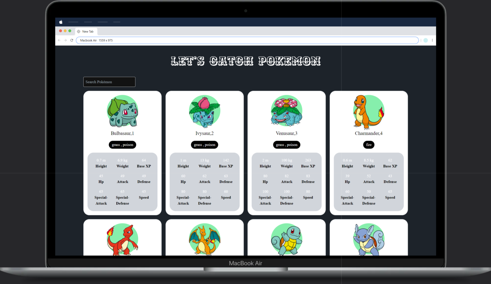

# Pokémon Infinite Scroll App

A React application that fetches Pokémon data from the PokéAPI, displays the data in a responsive card layout, and allows infinite scrolling to load more Pokémon. The app also includes a search feature to filter Pokémon by name.

## Features

- **Infinite Scroll**: Load more Pokémon as you scroll down the page.
- **Search Functionality**: Filter Pokémon by name using the search bar.
- **Responsive Design**: The layout adjusts to different screen sizes.
- **Error Handling**: Displays appropriate error messages when data fetching fails.
- **Back to Top Button**: Scroll back to the top with a smooth scrolling effect.

## Demo



## Technologies Used

- **React**: Core UI framework.
- **Tailwind CSS**: For responsive and modern styling.
- **PokéAPI**: To fetch Pokémon data.
- **React Infinite Scroll Component**: Handles infinite scrolling behavior.

## Getting Started

### Prerequisites

To run this project locally, you'll need:

- [Node.js](https://nodejs.org/) installed.
- [npm](https://www.npmjs.com/) or [yarn](https://yarnpkg.com/) package manager.

### Installation

1. Clone the repository:
    ```bash
    git clone https://github.com/your-username/pokemon-infinite-scroll.git
    cd pokemon-infinite-scroll
    ```

2. Install dependencies:
    ```bash
    npm install
    ```

3. Start the development server:
    ```bash
    npm start
    ```

4. Open the app in your browser:
    ```
    http://localhost:3000
    ```

## Project Structure

```bash
src/
│
├── components/
│   ├── Card.js              # The main card component that handles fetching and displaying Pokémon data
│   ├── CardInformation.js   # Renders individual Pokémon data in a card format
│
├── pages/
│   └── Pokemon.js           # Main page rendering the header and card components
│
└── App.js                   # Root component for the application
```

## API Usage

This project uses the **PokéAPI** to fetch data about various Pokémon.

- Basic endpoint to fetch Pokémon:
  ```
  https://pokeapi.co/api/v2/pokemon?limit=20&offset=0
  ```

- More detailed data for each Pokémon can be accessed through individual Pokémon URLs.

## Customization

### Styling

The app uses [Tailwind CSS](https://tailwindcss.com/) for styling. You can easily customize the design by modifying the utility classes within the JSX files.

### Pagination Offset

The number of Pokémon loaded at a time can be modified by changing the `limit` parameter in the `fetchPokemonData` function inside `Card.js`:

```js
const response = await fetch(`https://pokeapi.co/api/v2/pokemon?limit=20&offset=${offset}`);
```

## Contributing

Feel free to open issues or submit pull requests if you find any bugs or have suggestions for new features.

### Contribution Guidelines

1. Fork the repository.
2. Create a new branch with a descriptive name.
3. Commit your changes and push to the branch.
4. Open a pull request.

## License

This project is licensed under the MIT License.

---

Made with ❤️ by [Piyush Verma](https://github.com/mercy089)
